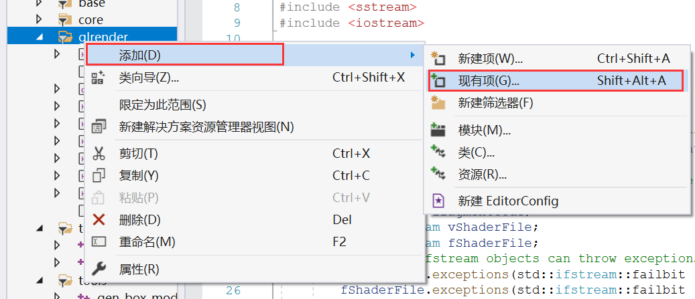
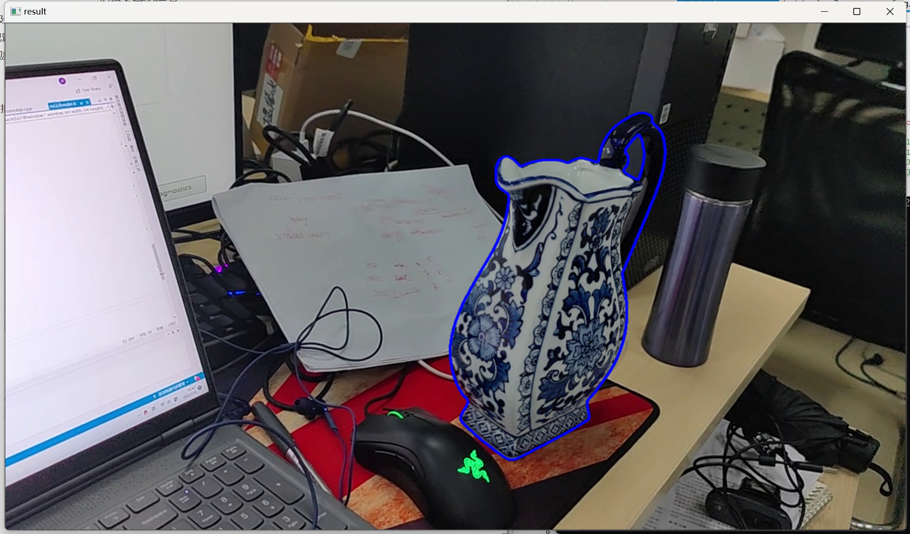
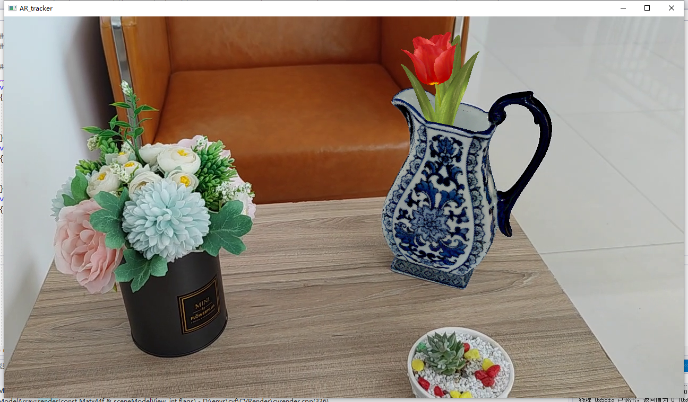

# 基本配置说明

> 以下配置过程基本环境：
>
> ​	Windows + VS2019（或VS2019 SDK）
>
> 各分支内容：
>
> ​	main分支仅包含跟踪代码
>
> ​	ar分支在此基础上可以生成简单的ar效果演示视频
>

## 相关内容下载及配置

1.BoxAR相关环境及测试模型、视频下载：[Google Drive](https://drive.google.com/drive/folders/1pekXpuN13F6YUA_k9wWGy0RT71mENaCL?usp=drive_link)

2.BoxAR代码下载

使用git clone命令或者下载zip文件将代码从仓库复制到本地

3.配置CVF/CVFX

- 使用文本编辑器打开local.props，修改D_CVF和D_CVFX为本地路径（PATH/CVF和PATH/CVFX）,D_CLOUD可以不修改，示例：

- 打开local.h，将D_CLOUD设置为CVF和CVFX的上层目录（PATH），示例：

  

- 如果运行时提示找不到dll，在项目属性设置里设置PATH=$(D_PATH)，示例：

- 正常情况下配置后可以编译运行代码，为了便于代码在不同机器上运行，请不要随便修改local.props之外的项目配置
- 注意：目前仅配置了x64/release，如果需要跟踪调试，可以在release模式下禁用优化重新编译
- 配置过程中如果遇到“pop_t：未声明的标识符”，可以参照[链接](https://blog.csdn.net/DLW__/article/details/122329784)修改

## GLAD和GLFW配置

1.GLAD下载

到[GLAD官网](http://glad.dav1d.de/) 下载glad.zip，示例：

解压glad.zip，得到include和src两个文件夹

2.GLFW下载

在仓库的glfw文件夹中有glfw.zip，解压到任意路径

3.GLAD和GLFW配置

在项目属性页VC++目录的包含目录中导入glad解压得到的include文件夹，将src文件夹中的glad.c添加到项目中

导入include文件夹示例：

将glad.c添加到项目示例：

在项目属性页VC++目录的库目录中导入glfw解压后得到的lib-vc2019文件夹所在路径，示例：

在项目属性页->链接器->附加依赖项中加入glfw3.lib，示例：

## 3D模型和测试视频

说明开始的链接中有演示视频中的花朵和青花瓷模型，具体使用方法在跟踪算法一节

# 总体流程

- 生成长方体模型
- 标定相机内参
- 在离线视频或实时视频中跟踪生成模型，得到位姿
- 以被跟踪模型为定位，实现想要的AR效果

## 长方体模型生成

> Attention: 将tools文件夹下的calibration.cpp在VS中添加到项目

### 准备工作

1.准备模型

要求：

- 具有充足的纹理特征（图案信息要丰富） （Tips：可以用笔画画）
- 每个面尽量不相同  （Tips：也可以用笔画一下）
- 不易发生形变 （坏例子： 非常容易形变的快递盒）

2.创建目录

如上图，在BoxAR目录下创建两个文件夹

- images 用来存放图片
- model 用来存放模型文件

### 模型放置与图片拍摄

测量模型的长宽高 单位： 毫米(mm)

要求在右手空间坐标系下按照长边贴近的原则摆放

随后需要按照一定的顺序进行拍摄（否则程序就不知道哪张图应该贴到盒子的什么位置:) )

将模型进行展开可以得到上图，接下来按照图片中的标号对物体进行拍并将其放到 ./images目录下，并按照刚刚的序号进行重命名，你应该得到如下的六张图片：

### 模型生成代码

1. 依次按照提示输入长、宽、高（mm）

2. 按照顺时针方向依次对六张图片选定模型的四个点，然后点击回车键进入下一张图片选择。如下图

   

3. 结束后应该在model目录下得到三个文件

   

4. 使用[MeshLab](https://en.softonic.com/download/meshlab/windows/post-download) 查看模型

## 相机内参获取

在程序中我们使用了默认的相机内参，如下图所示，其中参数1为图像尺寸，参数2为焦距和图像高度之比。为了获取准确的内参，请使用本节说明进行相机的标定。

我们在代码中使用了opencv自带的张氏标定法的例子

如果你想了解原理与具体的操作，可以查看[opencv 的官方链接](https://docs.opencv.org/4.x/d4/d94/tutorial_camera_calibration.html)

这里我们对配置部分做简单的介绍

### 打印标定板

将所给图片用彩色打印机打印 或直接在电脑或iPad上用图片显示

### 运行代码

- 选择1：拍摄一段视频
- 选择2：使用摄像头

分别在BoxAR\tools\calibration.cpp 中修改选择你的模式并按照提示修改路径。

请注意：**此处的默认宽和高均为7，计算方式为你打印的标定板宽/高方向上黑白色格子的总数-1。请检查你的标定板，若不同请做出修改**

在项目main函数中 执行exec("tools.calib_camera"); 即可运行代码

**为什么选用视频/摄像头：**

对于市面上的手机而言，视频模式和拍照模式的分辨率等属性不是一致的。由于后续的检测和跟踪中需要你去拍摄一段视频，所以我们要保证在这里检测到的相机参数是一致的。

**要求：**

1、不宜过长，10几秒的视频即可

2、移动标定板或者移动相机

3、角度尽量要多

4、**（很重要）保证标定板在你的视频中始终是完全出现的，不要出现遮挡和拍摄不全的情况**

在视频/摄像头模式下按g进行标定，总共进行20张图片的截取，当右下角提示calibration后即可退出或等待视频完毕。

 标定结束后，会在/BoxAR 目录下找到 camera.yml文件

其中，如图所示部分为所需的内参矩阵

## 跟踪算法及AR实现

### 跟踪算法

如果要使用单独的跟踪算法，在main.cpp中选择exec("test_detectors")执行，跟踪算法的测试函数在test_tracker.cpp中，核心算法在core文件夹中。在test_tracker.cpp中的test_detectors()函数中更改modelFile和videoFile变量可以选择待跟踪物体模型和测试视频。

如果要得到以下图片所示的演示效果，可以解压从上文链接中下载的flowerandvase.zip，将modelFile换成qinghuaci.obj所在路径，videoFile选择解压后的任意一测试视频路径

通过更改下图所示路径可以设置当前目录：

如果之前的CVF/CVFX配置已经正确完成，在VS2019中运行，会得到类似下图所示结果

### AR渲染

如果要在跟踪的基础上通过渲染实现简单的AR效果，需要在main.cpp中选择执行exec("test_ardetectors");

其测试函数在test_trackers2.cpp中，其中的路径修改方法与test_trackers.cpp中的相同

如果之前GLAD/GLFW配置以经完成，运行代码后会在程序所在文件夹生成一段演示视频，其路径可按照需求在test_trackers2.cpp中的下图位置修改

需要注意的是，推荐导出视频格式为avi，在上图中的Size设置时注意与要生成视频的图片保持相同。

要更改渲染的模型，可以在test_trackers2.cpp的obj_path变量处修改，如果要得到下图的效果，在上述修改modelFile和videoFile的基础上，将obj_path设置为解压后的flower/test.obj所在路径。

生成视频的效果如下图所示，其中花为渲染合成到原始图像的模型，你可以通过选择自己的测试视频、被跟踪模型、被渲染模型实现更高级的AR效果

**Attention:如果使用其他的模型没法得到预想的效果，可能是因为待跟踪物体模型和渲染合成模型之间的坐标系存在较大差异，可以使用meshlab进行调整（或者写一段读取obj文件直接修改的代码），如果使用meshlab，打开一个obj文件：**

**在下图所示菜单选项中的Transform项可以缩放、平移、旋转模型**

# 渲染代码说明

渲染代码主体来自[learnOpenGL](https://learnopengl-cn.github.io/)，各函数功能可参考该教程

# 扩展方向

仓库里的代码仅仅实现了一个非常简单的demo生成，要实现更高级的AR效果，可改进的方向包括但不限于：

- 发挥想象，设计更高级的AR场景
- 交互
- 跟换实时性更好的跟踪算法
- ……
